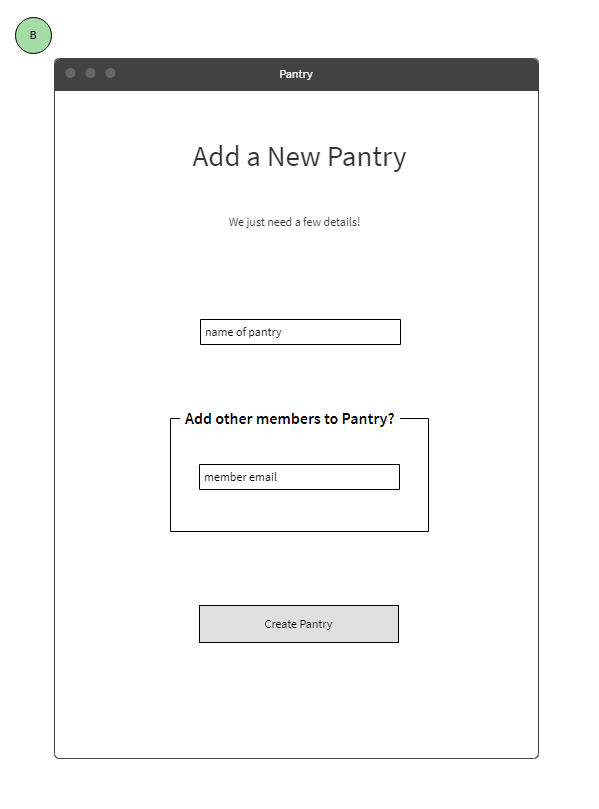

# Pantry

## NEED TO CREATE NEW GITHUB REPO AND HEROKU
### pantry-food-management-node-capstone 

## Live Preview
https://pantry-food-management.herokuapp.com/

## The Idea

This app will help you keep track of what food you have in your home - who put it there, when they put it there, how much is left, and some insights about your food use and spending. Users will create a "Pantry", which can be a specific refrigerator, cabinent, shelf, or location that you store food.

## User Stories

* As a user, I can create an account to login into the app and view saved data or tryout the app with a mock user profile
* As a user, I can keep track of your food in my house
  * Add individual items into my Pantry
  * Input information about items like quantity, price, expiration date, etc.
  * Reduce the quantity of an item as you use it, e.g. update a dozen eggs to eleven eggs
  * Remove an item from your Pantry when it is gone
  * View which of your household put the item there and view its cost for proper compensation
* As a user, I can join an existing Pantry or other members can join my Pantry
* As a user, I can view the history of activity within my Pantry
  * How much money did I spend on food this month?
  * Who ate most of the eggs from this carton?
  * View who drank the last of the milk so you can *kindly* ask them to get more!

## User Flows/Wireframes

### A. Landing Page
* enter email and password to login -> go to your account Pantry page (B)
* create new account -> new account sign up page (A1)
* try out app without signing up -> go to Pantry page with mock data (B)

##### A1. New Account Sign Up Page
User enters following information:
* First name
* Last Name
* Email
* Password
* Confirm password
* Existing Pantry to join.  If left blank, user is taken to new Pantry creation page (B)

##### B. New Pantry creation
* Name of Pantry
* Other members to include in Pantry

### C. View Items within the Pantry
* List of all items within Pantry
   * Displays quantity, description, who added the item inline
* Click to expand and edit details
   * Price of item (optional)
   * Expiration date (optional)
   * Description (optional)
   * Update quantity
   

### D. Edit items of Pantry
* Click on existing item to expand details
   * Remove button -> modal for confirmation of item removal. Pantry history updated with event (timestamp and user)
   * Click Update quantity -> field shows inline to update manually or "-"/"+" buttons to either side.  Has to be integer value.
* Button at top to add new item -> new item screen (D1)
   * App keeps track of user and timestamp for new item creation
   
#### D1. New Item Screen
Input fields:
* Name of item
* Quantity (value and units) e.g. 2 lbs or 12 ea (for discrete divisions like eggs)
* Price (optional)
* Expiration date (optional)
* Description (optional)
   

   
### E. Pantry History
Static log of Pantry name, actions taken within pantry, and users/timestamp of when each action was taken

## Business Objects (database structure)

* User (collection)
   * First name
   * Last name
   * Email
   * Password
   * Pantry they belong to
* Pantry (collection)
   * Name
   * List of users associated to Pantry
   * List of actions taken within Pantry history
* Item (collection)
   * Name
   * Quantity
   * Description
   * Price
   * Expiration Date 
   * Added by User
   * Last updated by User
   
## Screenshots
### Login
Appears when user first visits Pantry.  The user can login to their existing account, sign up for a new one, or try out the app with a mock account.

### Sign Up
If the user does not have an account, they can sign up for a new account here.  Here they can enter their account details and choose to either join an existing Pantry or sign up for a new one.

### Pantry Homepage
This will show the user's Pantry of items and details about those items.  

### Add Items
Clicking the "+ Add New Item" button will bring up the form to add a new item into the user's Pantry.

### Edit Items
Hovering over an item row in the pantry will show buttons to edit and delete that item.  Clicking edit will make the row type editable.

Clicking delete will show a modal to confirm the item deletion.

   
## Technologies Used

* HTML5
* CSS3
* JS ES6
* jQuery
* Node.js
* Express.js
* Mocha
* Chai
* MongoDB
* Mongoose
* TravisCI
* Heroku

