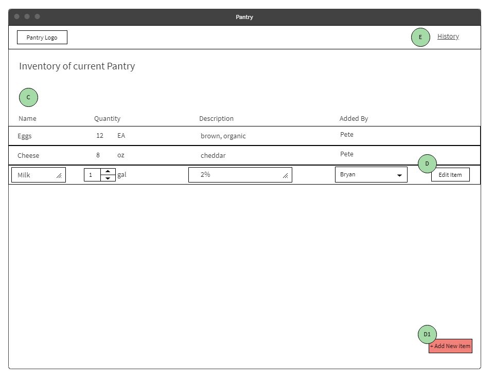

# Pantry

## NEED TO CREATE NEW GITHUB REPO AND HEROKU
### pantry-food-management-node-capstone 

## Live Preview
https://pantry-food-management.herokuapp.com/

## The Idea

This app will help you keep track of what food you have in your home - who put it there, when they put it there, how much is left, and some insights about your food use and spending. Users will create a "Pantry", which can be a specific refrigerator, cabinent, shelf, or location that you store food.

## User Stories

Users of Pantry will be able to use the app to perform functions like:

* Create an account to login into the app and view up your saved data or tryout the app with a mock user profile
* Join a household along with your roommates, family members, or co-workers
  * Keep track of multiple Pantries 
* Keep track of your food in your house(s)
  * Add individual items into your Pantry
  * Input information about items like quantity, price, expiration date, etc.
  * Reduce the quantity of an item as you use it, e.g. update a dozen eggs to eleven eggs
  * Remove an item from your Pantry when it is gone
  * View which of your household put the item there and view its cost for proper compensation
* Look at usage history
  * How much money did I spend on food this month?
  * Who ate most of the eggs from this carton?
  * View who drank the last of the milk so you can *kindly* ask them to get more!

## User Flows/Wireframes

### A. Landing Page
* enter email and password to login -> go to your account Pantry page (B)
* create new account -> new account sign up page (A1)
* try out app without signing up -> go to Pantry page with mock data (B)

##### A1. New Account Sign Up Page
User enters following information:
* First name
* Last Name
* Email
* Password
* Confirm password
* Existing household to join (optional)

### B. View your Pantries with option to create, leave/remove Pantry
* List of Pantries 
   * Click "Add" -> new Pantry creation page (B1)
   * Click "Remove" -> modal to confirm removal of Pantry
      * If Pantry no longer has any members, it is removed from the database in the background
      * Other people that belong to Pantry still see Pantry if a member leaves
      

   
##### B1. New Pantry creation
* Name of Pantry
* Other members to include in Pantry
* Location of Pantry
   * Combination of name and location has to be unique i.e. "My House" (location) cannot have two Pantries named "Refrigerator" and "Refrigerator". "Upstairs refrigerator" and "downstairs refrigerator" would be a valid name combination in "My House".

### C. View Items within the Pantry
* List of all items within Pantry
   * Displays quantity in line and date of addition to Pantry
* Click to expand details
   * Which household member added this item
   * Price of item (optional)
   * Expiration date (optional)
   * Description (optional)

### D. Edit items of Pantry
* Click on existing item to expand details
   * Remove button -> modal for confirmation of item removal. Pantry history updated with event (timestamp and user)
   * Click Update quantity -> field shows inline to update manually or "-"/"+" buttons to either side.  Has to be integer value.
* Button at top to add new item -> new item screen (D1)
   * App keeps track of user and timestamp for new item creation
   
#### D1. New Item Screen
Input fields:
* Name of item
* Quantity (value and units) e.g. 2 lbs or 12 ea (for discrete divisions like eggs)
* Price (optional)
* Expiration date (optional)
* Description (optional)
   
### E. Pantry History
Static log of Pantry name, actions taken within pantry, and users/timestamp of when each action was taken

